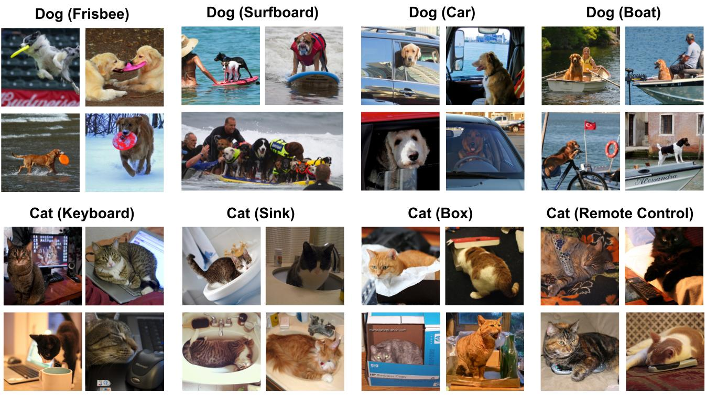
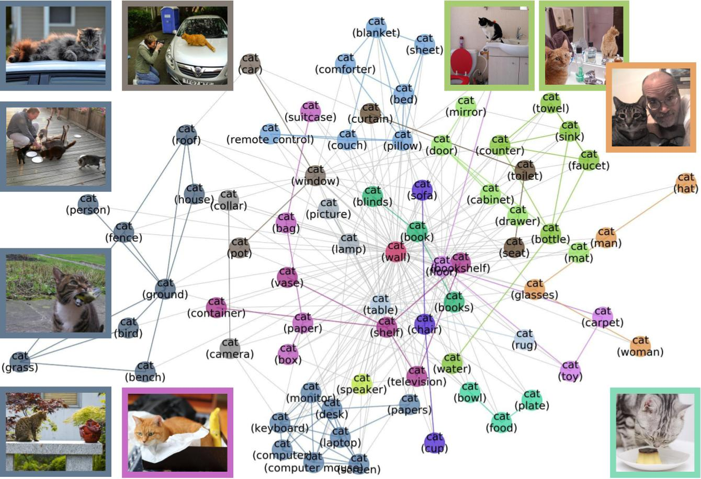
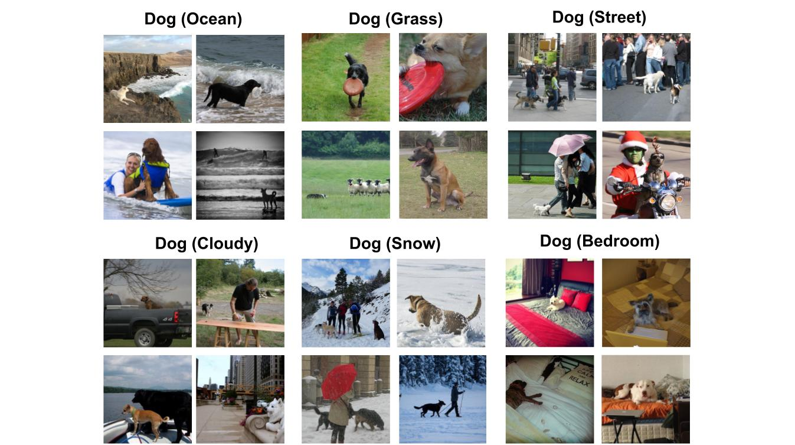
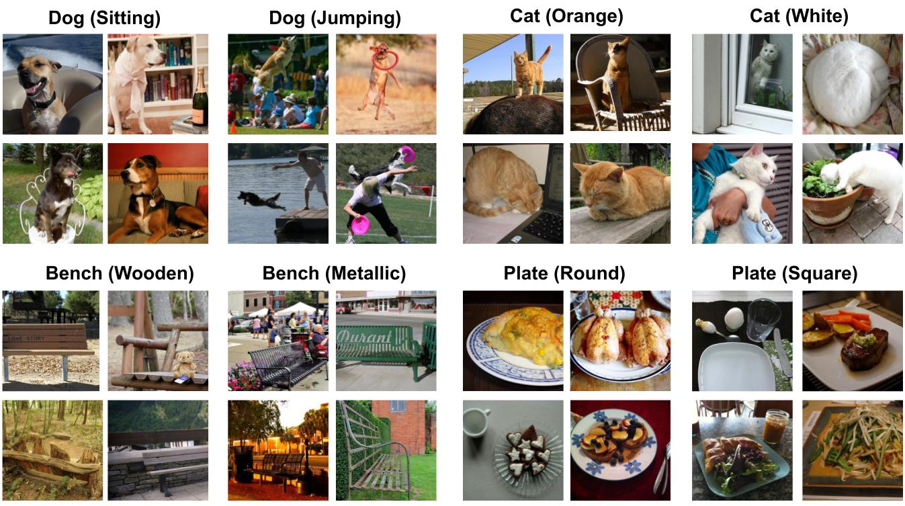

MetaShift: A Dataset of Datasets for Evaluating Contextual Distribution Shifts and Training Conflicts
=============================================================================================================

|Website shields.io| |Documentation Status| |License| |OpenReview| |Python 3.6| |Pytorch| |GitHub stars|

.. |License| image:: https://img.shields.io/badge/license-MIT-blue.svg
   :target: https://lbesson.mit-license.org/
.. |OpenReview| image:: https://img.shields.io/badge/OpenReview-rRMlg4sZQ15-green.svg
   :target: https://openreview.net/forum?id=rRMlg4sZQ15
.. |Python 3.6| image:: https://img.shields.io/badge/python-3.6-blue.svg
   :target: https://www.python.org/downloads/release/python-360/
.. |Pytorch| image:: https://img.shields.io/badge/Pytorch-1.8-red.svg
   :target: https://pytorch.org/
.. |Website shields.io| image:: https://img.shields.io/website-up-down-green-red/http/shields.io.svg
   :target: https://metashift.readthedocs.io/
.. |Documentation Status| image:: https://readthedocs.org/projects/metashift/badge/?version=latest
   :target: http://metashift.readthedocs.io/?badge=latest
.. |GitHub stars| image:: https://img.shields.io/github/stars/Weixin-Liang/MetaShift.svg?style=social&label=Star&maxAge=2592000
   :target: https://GitHub.com/Weixin-Liang/MetaShift/

Welcome! This is the project website of our paper: `MetaShift: A Dataset of Datasets for Evaluating Contextual Distribution Shifts and Training Conflicts <https://openreview.net/forum?id=MTex8qKavoS>`__ (ICLR 2022). 
`[PDF] <https://arxiv.org/abs/2202.06523>`__
`[Video] <https://recorder-v3.slideslive.com/#/share?share=64243&s=4b8a00e2-83f3-4775-879f-70de42374ec6>`__
`[Slides] <https://drive.google.com/file/d/1PDQSrNQWAJL_cx-KpV1CchUJwk2MgPFC/view?usp=sharing>`__

.. raw:: html
   
   <i class="fa fa-github"></i> View on and Install via <a
   href="https://github.com/Weixin-Liang/MetaShift/">GitHub.</a> 
      

Walkthroughs
------------

.. toctree::
   sub_pages/download_MetaShift
   sub_pages/example_images
   sub_pages/applications
   sub_pages/matching_to_ImageNet

   **Figure 1: Example Cat vs. Dog Images from MetaShift.** For each class, MetaShift provides many subsets of data, each of which corresponds different contexts (the context is stated in parenthesis). 

Abstract
----------------
*Understanding the performance of machine learning model across diverse data distributions is critically important for reliable applications. Motivated by this, there is a growing focus on curating benchmark datasets that capture distribution shifts. While valuable, the existing benchmarks are limited in that many of them only contain a small number of shifts and they lack systematic annotation about what is different across different shifts. We present MetaShift---a collection of 12,868 sets of natural images across 410 classes---to address this challenge. We leverage the natural heterogeneity of Visual Genome and its annotations to construct MetaShift. The key construction idea is to cluster images using its metadata, which provides context for each image (e.g. cats with cars or cats in bathroom) that represent distinct data distributions. MetaShift has two important benefits: first it contains orders of magnitude more natural data shifts than previously available. Second, it provides explicit explanations of what is unique about each of its data sets and a distance score that measures the amount of distribution shift between any two of its data sets. We demonstrate the utility of MetaShift in benchmarking several recent proposals for training models to be robust to data shifts. We find that the simple empirical risk minimization performs the best when shifts are moderate and no method had a systematic advantage for large shifts. We also show how MetaShift can help to visualize conflicts between data subsets during model training.*

What is :samp:`MetaShift`?
--------------------------------
The :samp:`MetaShift` is a collection of subsets of data together with an annotation graph that explains the similarity/distance between two subsets (edge weight) as well as what is unique about each subset (node metadata). For each class, say “cat”, we have many subsets of cats, and we can think of each subset as a node in the graph. Each subset corresponds to “cat” in a different context: e.g. “cat with sink” or “cat with fence”. The context of each subset is the node metadata. The “cat with sink” subset is more similar to “cat with faucet” subset because there are many images that contain both sink and faucet. This similarity is the weight of the node; higher weight means the contexts of the two nodes tend to co-occur in the same data. 
Each class also has is also associated with a meta-graph. 

.. figure:: ./figures/MetaShift-InfoGraphic.jpg
   :width: 100 %
   :align: center
   :alt: 

   **Figure 2: Infographics of MetaShift.** We leverage the natural heterogeneity of Visual Genome and its annotations to construct MetaShift. MetaShift is a collection of 12,868 sets of natural images from 410 classes. Each class has 31.4 subsets, and each subset has 200.4 images on average. 
   Each class also has is also associated with a meta-graph. 
   The subsets are characterized by a diverse collection of 1,853 distinct contexts. 

How can we use :samp:`MetaShift`?
------------------------------------------------
It is a flexible framework to generate a large number of real-world distribution shifts that are well-annotated and controlled. For each class of interest, say 'cats', we can use the meta-graph of cats to identify a collection of cats nodes for training (e.g. cats with bathroom related contexts) and a collection of cats nodes for out-of-domain evaluation (e.g. cats in outdoor contexts). Our meta-graph tells us exactly what is different between the train and test domains (e.g. bathroom vs. outdoor contexts), and it also specifies the similarity between the two contexts via graph distance. That makes it easy to carefully modulate the amount of distribution shift. For example, if we use cats-in-living-room as the test set, then this is an smaller distribution shift.  

   **Figure 3: Meta-graph for the “Cat” class, which captures meaningful semantics of the multi-modal data distribution of “Cat”.** MetaShift splits the data points of each class (e.g., Cat) into many subsets based on visual contexts. 
   Each node in the meta-graph represents one subset. The weight of each edge is the overlap coefficient between the corresponding two subsets. Node colors indicate the graph-based community detection results. Inter-community edges are colored. Intra-community edges are grayed out for better visualization. The border color of each example image indicates its community in the meta-graph. We have one such meta-graph for each of the 410 classes in the MetaShift.

Quantify Distances of Distribution Shifts
------------------------------------------------
The geometry of MetaGraphs provides a way to quantify the distances of shifts across different data distributions: Intuitively, if two subsets are far away from each other in the MetaGraph, then the shift between them tend to be large. We calculate spectral embeddings of each node in the meta-graph measures the distance between any two subsets. 

   **Figure: Example subsets based on general contexts.** 

   **Figure: Example subsets based on object attributes.** 

Citation
--------

.. code-block:: bibtex

   @InProceedings{liang2022metashift,
   title={MetaShift: A Dataset of Datasets for Evaluating Contextual Distribution Shifts and Training Conflicts},
   author={Weixin Liang and James Zou},
   booktitle={International Conference on Learning Representations},
   year={2022},
   url={https://openreview.net/forum?id=MTex8qKavoS}
   }
