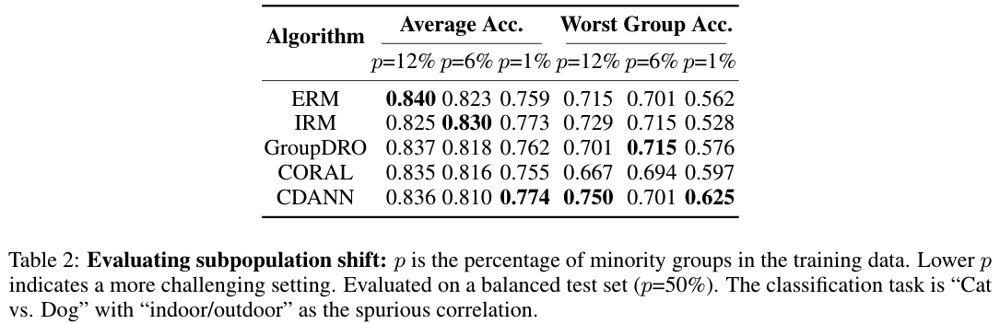
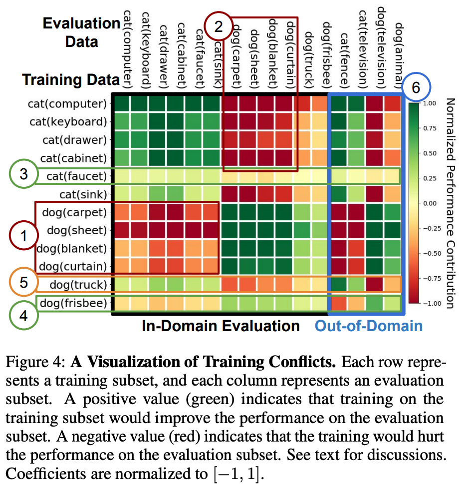

Applications of MetaShift
============================================

Welcome! This is the project website of our paper: `MetaShift: A Dataset of Datasets for Evaluating Contextual Distribution Shifts and Training Conflicts <https://openreview.net/forum?id=MTex8qKavoS>`__ (ICLR 2022). 
`[PDF] <https://arxiv.org/abs/2202.06523>`__
`[Video] <https://recorder-v3.slideslive.com/#/share?share=64243&s=4b8a00e2-83f3-4775-879f-70de42374ec6>`__
`[Slides] <https://drive.google.com/file/d/1PDQSrNQWAJL_cx-KpV1CchUJwk2MgPFC/view?usp=sharing>`__

Application: Evaluating Distribution Shifts
--------------------------------------------------

In domain generalization, the train and test distributions comprise data from related but distinct domains. 
This arises in many real-word scenarios since it is often infeasible to construct a comprehensive training set that spans all domains. 
To simulate this setting, we can sample two distinct collections of subsets as the train domains and the test domains respectively (e.g. bathroom vs. outdoor contexts). 
To adjust the magnitude of the shift, we can fix the test domains and change the train domains with different distance. For example, if we use cats-in-living-room as the test set, then this is an smaller distribution shift.  

.. figure:: ../figures/app-domain-generalization.png
   :width: 100 %
   :align: center
   :alt: 

Application: Evaluating Subpopulation Shifts
--------------------------------------------------

In subpopulation shifts, the train and test distributions are mixtures of the same domains with different mixture weights. This is a more frequently-encountered problem since real-world datasets often has minority groups, while standard models are often reported to perform poorly on under-represented demographics. 

To benchmark subpopulation shifts using MetaShift, we can sample two distinct collections of subsets as the minority groups and majority groups respectively. We then use different mixture weights to construct the training set and test set. 
For “Cat vs. Dog”, we leveraging the general contexts “indoor/outdoor” which has a natural spurious correlation with the class labels. 
Concretely, in the training data, cat(ourdoor) and dog(indoor) subsets are the minority groups, while cat(indoor) and dog(outdoor) are majority groups. 
We keep the total size of training data as 1700 images unchanged and only vary the portion of minority groups. 
We use a balanced test set with 576 images to report both average accuracy and worst group accuracy. 

Application: Accessing Training Conflicts
--------------------------------------------------
We also show how MetaShift can help to visualize conflicts between data subsets during model training.  

Citation
--------

.. code-block:: bibtex

   @InProceedings{liang2022metashift,
   title={MetaShift: A Dataset of Datasets for Evaluating Contextual Distribution Shifts and Training Conflicts},
   author={Weixin Liang and James Zou},
   booktitle={International Conference on Learning Representations},
   year={2022},
   url={https://openreview.net/forum?id=MTex8qKavoS}
   }