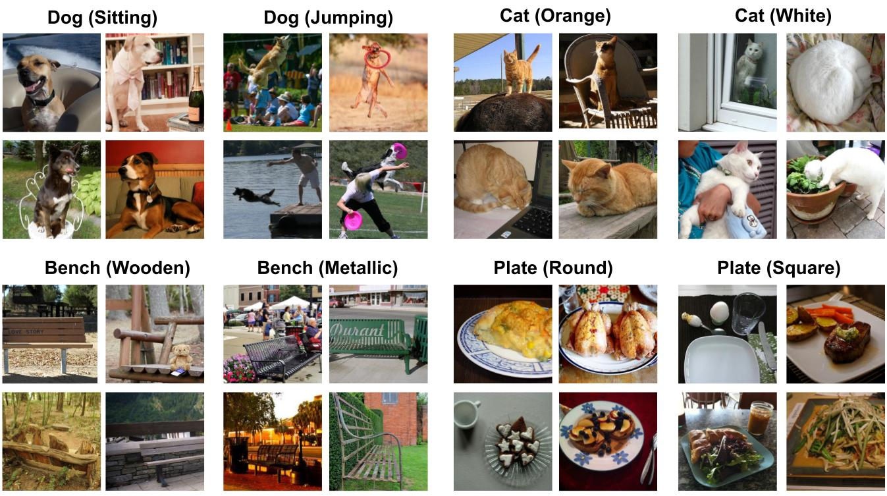

Getting Started: Download MetaShift
===============================================

Welcome! This is the project website of our paper: `MetaShift: A Dataset of Datasets for Evaluating Contextual Distribution Shifts and Training Conflicts <https://openreview.net/forum?id=MTex8qKavoS>`__ (ICLR 2022). 
`[PDF] <https://arxiv.org/abs/2202.06523>`__
`[Video] <https://recorder-v3.slideslive.com/#/share?share=64243&s=4b8a00e2-83f3-4775-879f-70de42374ec6>`__
`[Slides] <https://drive.google.com/file/d/1PDQSrNQWAJL_cx-KpV1CchUJwk2MgPFC/view?usp=sharing>`__

Download MetaShift Github Repo
------------------------------------
.. raw:: html
   
   <i class="fa fa-github"></i> Download at <a
   href="https://github.com/Weixin-Liang/MetaShift"> our GitHub repo.</a> 
      

Downlaod Base Dataset: Visual Genome
------------------------------------

We leveraged the natural heterogeneity of [Visual Genome](https://visualgenome.org) and its annotations to construct MetaShift. Download the pre-processed and cleaned version of Visual Genome by `GQA <https://arxiv.org/pdf/1902.09506.pdfL>`_. 

- Download image files (~20GB) from: https://nlp.stanford.edu/data/gqa/images.zip
- Download the annotations provided the base dataset (scene graphs): https://nlp.stanford.edu/data/gqa/sceneGraphs.zip  

.. code-block:: bash

   wget -c https://nlp.stanford.edu/data/gqa/images.zip
   unzip images.zip -d allImages
   wget -c https://nlp.stanford.edu/data/gqa/sceneGraphs.zip  
   unzip sceneGraphs.zip -d sceneGraphs

- Extract the files. After this step, the base dataset file structure should look like this:

.. code-block:: 

    /your_path/
        allImages/
            images/
                <ID>.jpg
                ...
        sceneGraphs/
            train_sceneGraphs.json
            val_sceneGraphs.json

- Specify local path of Visual Genome defined in ``dataset/Constants.py`` (e.g., ``IMAGE_DATA_FOLDER=/data/GQA/allImages/images/``). 
    

Understanding ``dataset/meta_data/full-candidate-subsets.pkl``
------------------------------------------------------------------------

The image IDs for each subset are provided as a Python Dictionary in ``generate_dataset/meta_data/full-candidate-subsets.pkl`` in the Github repo. The Python scpript ``generate_dataset/meta_data/create_MetaShift.py`` provides the code for generating the MetaShift. 

The metadata file ``dataset/meta_data/full-candidate-subsets.pkl`` is the most important piece of metadata of MetaShift, which provides the full subset information of MetaShift. To facilitate understanding, we have provided a notebook ``dataset/understanding_full-candidate-subsets-pkl.ipynb`` to show how to extract information from it. 

Basically, the pickle file stores a ``collections.defaultdict(set)`` object, which contains *17,938* keys. Each key is a string of the subset name like ``dog(frisbee)``, and the corresponding value is a list of the IDs of the images that belong to this subset. The image IDs can be used to retrieve the image files from the Visual Genome dataset that you just downloaded. In our current version, *13,543* out of *17,938* subsets have more than 25 valid images. In addition, ``dataset/meta_data/full-candidate-subsets.pkl`` is drived from the `scene graph annotation <https://nlp.stanford.edu/data/gqa/sceneGraphs.zip>`_, so check it out if your project need additional information about each image. 

.. figure:: ../figures/MetaShift-InfoGraphic.jpg
   :width: 100 %
   :align: center
   :alt: 

   **Figure: Infographics of MetaShift.** 

Generate the Full MetaShift Dataset
------------------------------------

Since the total number of all subsets is very large, all of the following scripts only generate a subset of MetaShift. As specified in [dataset/Constants.py](./dataset/Constants.py), we only generate MetaShift for the following classes (subjects). You can add any additional classes (subjects) into the list. See [dataset/meta_data/class_hierarchy.json](./dataset/meta_data/class_hierarchy.json) for the full object vocabulary and its hierarchy. 

    .. code-block:: python

        SELECTED_CLASSES = [
            'cat', 'dog',
            'bus', 'truck',
            'elephant', 'horse',
            'bowl', 'cup',
            ]

In addition, to save storage, all copied images are symbolic links. You can set ``use_symlink=True`` in the code to perform actual file copying. If you really want to generate the **full** MetaShift, then set ``ONLY_SELECTED_CLASSES = True`` in ``dataset/Constants.py``. 

.. code-block:: bash
    
    cd dataset/
    python generate_full_MetaShift.py

The following files will be generated by executing the script. Modify
the global varaible ``SUBPOPULATION_SHIFT_DATASET_FOLDER`` to change the
destination folder.

.. code:: plain

   /data/MetaShift/MetaDataset-full
   ├── cat/
       ├── cat(keyboard)/
       ├── cat(sink)/ 
       ├── ... 
   ├── dog/
       ├── dog(surfboard) 
       ├── dog(boat)/ 
       ├── ...
   ├── bus/ 
   ├── ...

Beyond the generated MetaShift dataset, the scipt also genervates the
meta-graphs for each class in ``dataset/meta-graphs``.

.. code:: plain

   .
   ├── README.md
   ├── dataset/
       ├── generate_full_MetaShift.py
       ├── meta-graphs/             (generated meta-graph visualization) 
           ├──  cat_graph.jpg
           ├──  dog_graph.jpg
           ├──  ...
       ├── ...         

.. figure:: ../figures/Cat-MetaGraph.jpg
   :width: 100 %
   :align: center
   :alt: 

   **Figure: Meta-graph for the “Cat” class.** 

.. figure:: ../figures/Dog-MetaGraph.jpg
   :width: 100 %
   :align: center
   :alt: 

   **Figure: Meta-graph for the “Dog” class.** 

Bonus: Generate the MetaShift-Attributes Dataset (subsets defined by subject attributes)
----------------------------------------------------------------------------------------

   **Figure: Example Subsets based on object attribute contexts** 
   (the attribute is stated in parenthesis). MetaShift covers attributes including activity (e.g., sitting, jumping), color (e.g., orange, white), material (e.g., wooden, metallic), shape (e.g., round, square), and so on.

Understanding ``dataset/attributes_MetaShift/attributes-candidate-subsets.pkl``
~~~~~~~~~~~~~~~~~~~~~~~~~~~~~~~~~~~~~~~~~~~~~~~~~~~~~~~~~~~~~~~~~~~~~~~~~~~~~~~

``dataset/attributes_MetaShift/attributes-candidate-subsets.pkl`` stores
the metadata for MetaShift-Attributes, where each subset is defined by
the attribute of the subject, e.g. ``cat(orange)``, ``cat(white)``,
``dog(sitting)``, ``dog(jumping)``.

``attributes-candidate-subsets.pkl`` has the same data format as
``full-candidate-subsets.pkl``. To facilitate understanding, we have
provided a notebook
``dataset/attributes_MetaShift/understanding_attributes-candidate-subsets-pkl.ipynb``
to show how to extract information from it.

Basically, the pickle file stores a ``collections.defaultdict(set)``
object, which contains *4,962* keys. Each key is a string of the subset
name like ``cat(orange)``, and the corresponding value is a list of the
IDs of the images that belong to this subset. The image IDs can be used
to retrieve the image files from the Visual Genome dataset that you just
downloaded.

Understanding ``dataset/attributes_MetaShift/structured-attributes-candidate-subsets.pkl``
~~~~~~~~~~~~~~~~~~~~~~~~~~~~~~~~~~~~~~~~~~~~~~~~~~~~~~~~~~~~~~~~~~~~~~~~~~~~~~~~~~~~~~~~~~

``dataset/attributes_MetaShift/structured-attributes-candidate-subsets.pkl``
is very similar to
``dataset/attributes_MetaShift/attributes-candidate-subsets.pkl``, but
stores the metadata in a more structured way. The pickle file stores a
3-level nested dictionary, with the following structure:

.. code:: plain

   .
   ├── key: 'color'
       ├── key: 'cat'              
           ├── key: 'orange'
               ├── value: a list of image IDs
   ├── key: 'activity'
       ├── key: 'dog'              
           ├── key: 'sitting'
               ├── value: a list of image IDs
           ├── ...

See the full attrribute ontology in ``ATTRIBUTE_CONTEXT_ONTOLOGY`` in
``dataset/Constants.py``

.. code:: python

   ATTRIBUTE_CONTEXT_ONTOLOGY = {
    'darkness': ['dark', 'bright'],
    'dryness': ['wet', 'dry'],
    'colorful': ['colorful', 'shiny'],
    'leaf': ['leafy', 'bare'],
    'emotion': ['happy', 'calm'],
    'sports': ['baseball', 'tennis'],
    'flatness': ['flat', 'curved'],
    'lightness': ['light', 'heavy'],
    'gender': ['male', 'female'],
    'width': ['wide', 'narrow'],
    'depth': ['deep', 'shallow'],
    'hardness': ['hard', 'soft'],
    'cleanliness': ['clean', 'dirty'],
    'switch': ['on', 'off'],
    'thickness': ['thin', 'thick'],
    'openness': ['open', 'closed'],
    'height': ['tall', 'short'],
    'length': ['long', 'short'],
    'fullness': ['full', 'empty'],
    'age': ['young', 'old'],
    'size': ['large', 'small'],
    'pattern': ['checkered', 'striped', 'dress', 'dotted'],
    'shape': ['round', 'rectangular', 'triangular', 'square'],
    'activity': ['waiting', 'staring', 'drinking', 'playing', 'eating', 'cooking', 'resting', 
                 'sleeping', 'posing', 'talking', 'looking down', 'looking up', 'driving', 
                 'reading', 'brushing teeth', 'flying', 'surfing', 'skiing', 'hanging'],
    'pose': ['walking', 'standing', 'lying', 'sitting', 'running', 'jumping', 'crouching', 
               'bending', 'smiling', 'grazing'],
    'material': ['wood', 'plastic', 'metal', 'glass', 'leather', 'leather', 'porcelain', 
               'concrete', 'paper', 'stone', 'brick'],
    'color': ['white', 'red', 'black', 'green', 'silver', 'gold', 'khaki', 'gray', 
               'dark', 'pink', 'dark blue', 'dark brown',
               'blue', 'yellow', 'tan', 'brown', 'orange', 'purple', 'beige', 'blond', 
               'brunette', 'maroon', 'light blue', 'light brown']
   }

Section 4.2: Evaluating Subpopulation Shifts
--------------------------------------------

Run the python script
``dataset/subpopulation_shift_cat_dog_indoor_outdoor.py`` to reproduce
the MetaShift subpopulation shift dataset (based on Visual Genome
images) in the paper.

.. code:: sh

   cd dataset/
   python subpopulation_shift_cat_dog_indoor_outdoor.py

The python script generates a “Cat vs. Dog” dataset, where the general
contexts “indoor/outdoor” have a natural spurious correlation with the
class labels.

The following files will be generated by executing the python script
``dataset/subpopulation_shift_cat_dog_indoor_outdoor.py``.

Output files (mixed version: for reproducing experiments)
~~~~~~~~~~~~~~~~~~~~~~~~~~~~~~~~~~~~~~~~~~~~~~~~~~~~~~~~~

.. code:: plain

   /data/MetaShift/MetaShift-subpopulation-shift
   ├── imageID_to_group.pkl
   ├── train/
       ├── cat/             (more cat(indoor) images than cat(outdoor))
       ├── dog/             (more dog(outdoor) images than cat(indoor)) 
   ├── val_out_of_domain/
       ├── cat/             (cat(indoor):cat(outdoor)=1:1)
       ├── dog/             (dog(indoor):dog(outdoor)=1:1) 

where ``imageID_to_group.pkl`` is a dictionary with 4 keys :
``'cat(outdoor)'``, ``'cat(outdoor)'``, ``'dog(outdoor)'``,
``'dog(outdoor)'``. The corresponding value of each key is the list of
the names of the images that belongs to that subset. Modify the global
varaible ``SUBPOPULATION_SHIFT_DATASET_FOLDER`` to change the
destination folder. You can tune the ``NUM_MINORITY_IMG`` to control the
amount of subpopulation shift.

Output files (unmixed version, for other potential uses)
~~~~~~~~~~~~~~~~~~~~~~~~~~~~~~~~~~~~~~~~~~~~~~~~~~~~~~~~

To facilitate other potential uses, we also outputs an unmixed version,
where we output the ``'cat(outdoor)'``, ``'cat(outdoor)'``,
``'dog(outdoor)'``, ``'dog(outdoor)'`` into 4 seperate folders. Modify
the global varaible ``CUSTOM_SPLIT_DATASET_FOLDER`` to change the
destination folder.

.. code:: plain

   /data/MetaShift/MetaShift-Cat-Dog-indoor-outdoor
   ├── imageID_to_group.pkl
   ├── train/
       ├── cat/             (all cat(indoor) images)
           ├── cat(indoor)/
       ├── dog/             (all dog(outdoor) images) 
           ├── dog(outdoor)/
   ├── test/
       ├── cat/             (all cat(outdoor) images)
           ├── cat(outdoor)/
       ├── dog/             (all dog(indoor) images) 
           ├── dog(indoor)/

Appendix D: Constructing MetaShift from COCO Dataset
----------------------------------------------------

The notebook ``dataset/extend_to_COCO/coco_MetaShift.ipynb`` reproduces
the COCO subpopulation shift dataset in paper Appendix D. Executing the
notebook would construct a “Cat vs. Dog” task based on COCO images,
where the “indoor/outdoor” contexts are spuriously correlated with the
class labels.

Install COCO Dependencies
~~~~~~~~~~~~~~~~~~~~~~~~~

Install pycocotools (for evaluation on COCO):

::

   conda install cython scipy
   pip install -U 'git+https://github.com/cocodataset/cocoapi.git#subdirectory=PythonAPI'

COCO Data preparation
~~~~~~~~~~~~~~~~~~~~~

`2017 Train/Val annotations
[241MB] <http://images.cocodataset.org/annotations/annotations_trainval2017.zip>`__

`2017 Train images
[118K/18GB] <http://images.cocodataset.org/zips/train2017.zip>`__

Download and extract COCO 2017 train and val images with annotations
from `http://cocodataset.org <http://cocodataset.org/#download>`__. We
expect the directory structure to be the following:

::

   /home/ubuntu/data/coco/
     annotations/  # annotation json files
     train2017/    # train images
     val2017/      # val images

Modify the global varaible ``IMAGE_DATA_FOLDER`` to change the COCO
image folder.

.. _output-files-mixed-version-for-reproducing-experiments-1:

Output files (mixed version: for reproducing experiments)
~~~~~~~~~~~~~~~~~~~~~~~~~~~~~~~~~~~~~~~~~~~~~~~~~~~~~~~~~

The following files will be generated by executing the notebook.

.. code:: plain

   /data/MetaShift/COCO-Cat-Dog-indoor-outdoor
   ├── imageID_to_group.pkl
   ├── train/
       ├── cat/
       ├── dog/ 
   ├── val_out_of_domain/
       ├── cat/
       ├── dog/ 

where ``imageID_to_group.pkl`` is a dictionary with 4 keys :
``'cat(outdoor)'``, ``'cat(outdoor)'``, ``'dog(outdoor)'``,
``'dog(outdoor)'``. The corresponding value of each key is the list of
the names of the images that belongs to that subset. Modify the global
varaible ``CUSTOM_SPLIT_DATASET_FOLDER`` to change the destination
folder.

Section 4.1: Evaluating Domain Generalization
---------------------------------------------

Run the python script ``dataset/domain_generalization_cat_dog.py`` to
reproduce the MetaShift domain generalization dataset (based on Visual
Genome images) in the paper.

.. code:: sh

   cd dataset/
   python domain_generalization_cat_dog.py

Output files (cat vs. dog, unmixed version)
~~~~~~~~~~~~~~~~~~~~~~~~~~~~~~~~~~~~~~~~~~~

The following files will be generated by executing the python script
``dataset/domain_generalization_cat_dog.py``. Modify the global varaible
``CUSTOM_SPLIT_DATASET_FOLDER`` to change the COCO image folder.

.. code:: plain

   /data/MetaShift/Domain-Generalization-Cat-Dog
   ├── train/
       ├── cat/
           ├── cat(sofa)/              (The cat training data is always cat(\emph{sofa + bed}) ) 
           ├── cat(bed)/               (The cat training data is always cat(\emph{sofa + bed}) )
       ├── dog/
           ├── dog(cabinet)/           (Experiment 1: the dog training data is dog(\emph{cabinet + bed}))
           ├── dog(bed)/               (Experiment 1: the dog training data is dog(\emph{cabinet + bed}))

           ├── dog(bag)/               (Experiment 2: the dog training data is dog(\emph{bag + box}))
           ├── dog(box)/               (Experiment 2: the dog training data is dog(\emph{bag + box}))

           ├── dog(bench)/             (Experiment 3: the dog training data is dog(\emph{bench + bike}))
           ├── dog(bike)/              (Experiment 3: the dog training data is dog(\emph{bench + bike}))

           ├── dog(boat)/              (Experiment 4: the dog training data is dog(\emph{boat + surfboard}))
           ├── dog(surfboard)/         (Experiment 4: the dog training data is dog(\emph{boat + surfboard}))

   ├── test/
       ├── dog/
           ├── dog(shelf)/             (The test set we used in the paper)
           ├── dog(sofa)/             
           ├── dog(grass)/             
           ├── dog(vehicle)/             
           ├── dog(cap)/                         
       ├── cat/
           ├── cat(shelf)/
           ├── cat(grass)/
           ├── cat(sink)/
           ├── cat(computer)/
           ├── cat(box)/
           ├── cat(book)/

Code for Distribution Shift Experiments
---------------------------------------

The python script
``experiments/distribution_shift/main_generalization.py`` is the entry
point for running the distribution shift experiemnts for Section 4.2
(Evaluating Subpopulation Shifts) and Appendix D (Constructing MetaShift
from COCO Dataset), and Section 4.1 (Evaluating Domain Generalization).
As a running example, the default value for ``--data`` in ``argparse``
is ``/data/MetaShift/MetaShift-subpopulation-shift`` (i.e., for Section
4.2).

.. code:: sh

   clear && CUDA_VISIBLE_DEVICES=3 python main_generalization.py --num-domains 2 --algorithm ERM 
   clear && CUDA_VISIBLE_DEVICES=4 python main_generalization.py --num-domains 2 --algorithm GroupDRO 
   clear && CUDA_VISIBLE_DEVICES=5 python main_generalization.py --num-domains 2 --algorithm IRM 
   clear && CUDA_VISIBLE_DEVICES=6 python main_generalization.py --num-domains 2 --algorithm CORAL 
   clear && CUDA_VISIBLE_DEVICES=7 python main_generalization.py --num-domains 2 --algorithm CDANN 

Our code is based on the
`DomainBed <https://github.com/facebookresearch/DomainBed>`__, as
introduced in `In Search of Lost Domain
Generalization <https://arxiv.org/abs/2007.01434>`__. The codebase also
provides `many additional
algorithms <experiments/subpopulation_shift/algorithms.py>`__. Many
thanks to the authors and developers!

.. |License| image:: https://img.shields.io/badge/license-MIT-blue.svg
   :target: ./LICENSE
.. |OpenReview| image:: https://img.shields.io/badge/OpenReview-MTex8qKavoS-b31b1b.svg
   :target: https://openreview.net/forum?id=MTex8qKavoS
.. |Python 3.6| image:: https://img.shields.io/badge/python-3.6-blue.svg
   :target: https://www.python.org/downloads/release/python-360/
.. |Pytorch| image:: https://img.shields.io/badge/Pytorch-1.8-red.svg
   :target: https://shields.io/

Citation
--------

.. code-block:: bibtex

   @InProceedings{liang2022metashift,
   title={MetaShift: A Dataset of Datasets for Evaluating Contextual Distribution Shifts and Training Conflicts},
   author={Weixin Liang and James Zou},
   booktitle={International Conference on Learning Representations},
   year={2022},
   url={https://openreview.net/forum?id=MTex8qKavoS}
   }