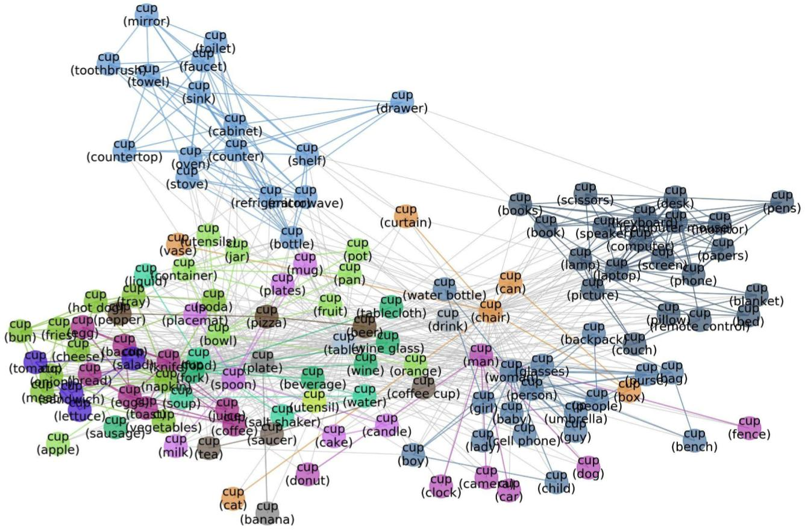

Preview: Example Images in MetaShift
============================================
For each image class (e.g. *Dogs*), the MetaShift contains different sets of dogs under different contexts to represent diverse data distributions. The contexts include presence/absence of other objects (e.g. *dog with frisbee*). Contexts can also reflect attributes (e.g. *black dogs*) and general settings (e.g. *dogs in sunny weather*). These concepts thus captures diverse and real-world distribution shifts. We list the object presense, attribute and general location contexts below.  

.. figure:: ../figures/MetaShift-InfoGraphic.jpg
   :width: 100 %
   :align: center
   :alt: 

Presence/Absence of Other Objects
----------------------------------------
MetaShift considers the presence/absence of 1,702 distinct object classes.  We use the pre-processed and cleaned version of Visual Genome by Hudson and Manning which contains 113,018 distinct images across 1,702 object classes. MetaShift is a collection of 12,868 sets of natural images from 410 classes. Each class has 31.4 subsets, and each subset has 200.4 images on average. 

.. figure:: ../figures/MetaShift-Examples.jpg
   :width: 100 %
   :align: center
   :alt: 

   **Figure: Example Cat vs. Dog Images from MetaShift.** For each class, MetaShift provides many subsets of data, each of which corresponds different contexts (the context is stated in parenthesis). 

Different subsets may share common images---e.g. a dog image can have both grass and frisbee would occur in both \emph{dog with grass} and \emph{dog with frisbee}. 
Therefore, the total number of subsets times the average number of images in each subset is much larger than the original dataset. The distance between subsets capture this overlap, but also broader similarities. 

General Contexts (Locations and Weather)
---------------------------------------------
MetaShift covers 37 general contexts including location (e.g., indoor, outdoor, ocean, snow) and weather (e.g., couldy, sunny, rainy). 

.. figure:: ../figures/MetaShift-Global-Examples.jpg
   :width: 100 %
   :align: center
   :alt: 

   **Figure: Example subsets based on general contexts.** 

The attributes and their ontology in MetaShift are as follows: 

.. code-block:: python

    GENERAL_CONTEXT_ONTOLOGY = {
        'indoor/outdoor': ['indoors', 'outdoors'],
        'weather': ['clear', 'overcast', 'cloudless', 'cloudy', 'sunny', 'foggy', 'rainy'],
        'room': ['bedroom', 'kitchen', 'bathroom', 'living room'],
        'place': ['road', 'sidewalk', 'field', 'beach', 'park', 'grass', 'farm', 'ocean', 'pavement',
                'lake', 'street', 'train station', 'hotel room', 'church', 'restaurant', 'forest', 'path', 
                'display', 'store', 'river', 'yard', 'snow', 'airport', 'parking lot']
    }

Object Attributes
---------------------------------------------
MetaShift covers attributes including activity (e.g., sitting, jumping), color (e.g., orange, white), material (e.g., wooden, metallic), shape (e.g., round, square) and so on. 

.. figure:: ../figures/MetaShift-Attributes-Examples.jpg
   :width: 100 %
   :align: center
   :alt: 

   **Figure: Example subsets based on object attributes.** 

The general contexts and their ontology in MetaShift are as follows: 

.. code-block:: python

    ATTRIBUTE_CONTEXT_ONTOLOGY = {
    'darkness': ['dark', 'bright'], 'dryness': ['wet', 'dry'],
    'colorful': ['colorful', 'shiny'], 'leaf': ['leafy', 'bare'],
    'emotion': ['happy', 'calm'], 'sports': ['baseball', 'tennis'],
    'flatness': ['flat', 'curved'], 'lightness': ['light', 'heavy'],
    'gender': ['male', 'female'], 'width': ['wide', 'narrow'],
    'depth': ['deep', 'shallow'], 'hardness': ['hard', 'soft'],
    'cleanliness': ['clean', 'dirty'], 'switch': ['on', 'off'],
    'thickness': ['thin', 'thick'], 'openness': ['open', 'closed'],
    'height': ['tall', 'short'], 'length': ['long', 'short'],
    'fullness': ['full', 'empty'], 'age': ['young', 'old'],
    'size': ['large', 'small'], 'pattern': ['checkered', 'striped', 'dress', 'dotted'],
    'shape': ['round', 'rectangular', 'triangular', 'square'],
    'activity': ['waiting', 'staring', 'drinking', 'playing', 'eating', 'cooking', 'resting', 
                'sleeping', 'posing', 'talking', 'looking down', 'looking up', 'driving', 
                'reading', 'brushing teeth', 'flying', 'surfing', 'skiing', 'hanging'],
    'pose': ['walking', 'standing', 'lying', 'sitting', 'running', 'jumping', 'crouching', 
                'bending', 'smiling', 'grazing'],
    'material': ['wood', 'plastic', 'metal', 'glass', 'leather', 'leather', 'porcelain', 
                'concrete', 'paper', 'stone', 'brick'],
    'color': ['white', 'red', 'black', 'green', 'silver', 'gold', 'khaki', 'gray', 
                'dark', 'pink', 'dark blue', 'dark brown',
                'blue', 'yellow', 'tan', 'brown', 'orange', 'purple', 'beige', 'blond', 
                'brunette', 'maroon', 'light blue', 'light brown']
    }

More Examples of Meta-graphs
---------------------------------------------
.. figure:: ../figures/Cat-MetaGraph.jpg
   :width: 100 %
   :align: center
   :alt: 

   **Figure: Meta-graph for the “Cat” class, which captures meaningful semantics of the multi-modal data distribution of “Cat”.** MetaShift splits the data points of each class (e.g., Cat) into many subsets based on visual contexts. 
   Each node in the meta-graph represents one subset. The weight of each edge is the overlap coefficient between the corresponding two subsets. Node colors indicate the graph-based community detection results. Inter-community edges are colored. Intra-community edges are grayed out for better visualization. The border color of each example image indicates its community in the meta-graph. We have one such meta-graph for each of the 410 classes in the MetaShift.

.. figure:: ../figures/Dog-MetaGraph.jpg
   :width: 100 %
   :align: center
   :alt: 

   **Figure: Meta-graph for the “Dog” class**

   **Figure: Meta-graph for the “Cup” class**

Citation
--------

.. code-block:: bibtex

   @InProceedings{liang2022metashift,
   title={MetaShift: A Dataset of Datasets for Evaluating Contextual Distribution Shifts and Training Conflicts},
   author={Weixin Liang and James Zou},
   booktitle={International Conference on Learning Representations},
   year={2022},
   url={https://openreview.net/forum?id=MTex8qKavoS}
   }